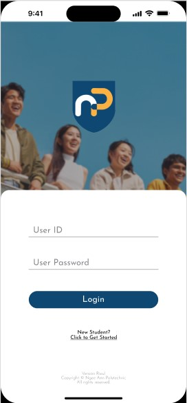
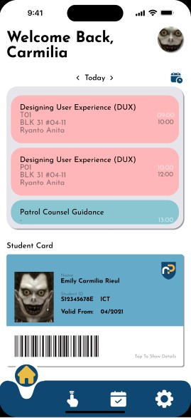
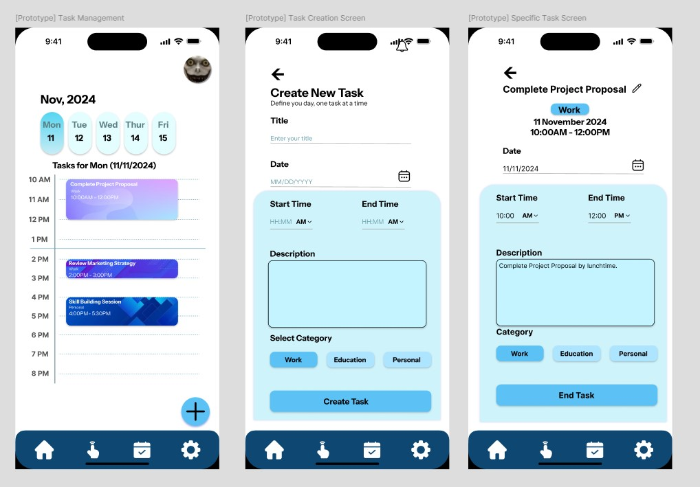

# MAD25_T01_Team2
Repository for MAD Assignment

## Disclaimer
This is a student assignment project for the Kotlin App Development module at Ngee Ann Polytechnic. Developed for educational purposes.

---

## Team Members
- Emily | S10227383E
- Joseph | S10262528G
- Monisha | S10220984G
- Thomas | S10259398B

---

## Project Title
# **NPAL2 — Android Mobile Application Re-Design**
NPal2 - Ngee Ann Polytechnic 

A Central Pulse, Within Reach

---

## 1. Introduction & Purpose
The NPAL2 platform serves as a key digital interface for Ngee Ann Polytechnic students, providing access to academic resources, administrative services, and campus-related information. However, the existing NPAL2 mobile application and respective web platform are often fragmented and inconsistent, resulting in a disjointed user experience. 
Students must navigate multiple systems to perform basic tasks such as checking timetables, managing assignments, accessing campus facilities, or viewing announcements. Furthermore, the current application interface is outdated and lacks modern usability features expected by today’s mobile users.

---

## 2. Motivation & Objectives

## Identified User Problems
- User wants to access NPAL on mobile
  - The existing NPAL app isn't available
  - E.g. Common Test Information - Venue, Seat Number, etc.
    
- Navigation on-campus
  - Student and lecturers often find navigation difficult and confusing on campus
    
- Students do not find a tangible reason for continuous, and consistent usage of the app due to:
  - Heavily centralising the app's purpose to simply viewing timetables, scanning attendance or grades, resulting in low engagement in the app altogether.
 
## Competitor Analysis

- NP Go!
  - Students consistently use the app for attendance taking purposes, centering its main purpose on the specific function.
  - Simple UI provides students a conveninent, intuitive and efficient experience.
    
- Mobile Calendar Apps (Google Calendar, Apple Calendar)
  - Used by students for general task tracking.
  - Lacks integration with school-specific events, maps, and task notifications.
  
### Motivation
- The exisiting NPAL2 mobile application and the NPAL website are **inconsistent**.
- The User Interface is **outdated**.

### Objectives
- Unify the NP student experience into **one application**.
- Improve accessbility and daily utility.

---

## 3. Key Features

### 1. Authentication & User Access 

#### 1.1 Login with NP Credentials
Allows students to securely log in using their NP username and password, providing access to personalised academic and campus services.
#### 1.2 First Time Student Set-Up Page
Guides new students through initial account setup
#### 1.3 Biometric Login
Enables secure and convenient access using the user's fingerprint, reducing the need to repeatedly enter login credentials. To account for specific devices that may not have this feature, users will still be defaulted to entering their user account credentials.

### 2. Student Identity & Campus Access

#### 2.1 Digital Student Card
A digital version of the student ID that can be used for identification purposes, campus access and library borrowing, reducing the need to constantly rely on physical cards.

### 3. Academic & Student Life Tools

#### 3.1 Student Calendar
Integrates class schedules, exam dates, and campus events into a unified calendar, helping students manage their time effectively.
#### 3.2 Task Management
Allows student to track assignments, projects, and personal tasks, with reminders and deadlines to faciliate productivity and planning.
### 4. Campus Navigation & Facilities

#### 4.1 Interactive Campus Map
Provides a detailed, interactive map of the campus with navigation features, showing locations of classrooms, labs, administrative offices, and amenities.
### 5. Notifications & Alerts
Sends real-time updates about timetable changes, announcements, deadlines, and campus alerts/information, ensuring students stay informed about important events.
### 6. Security & Account Protection

#### 6.1 Encrypted Login
Ensures that all login and personal data are encrypted, safeguarding student information from unauthorised access.
#### 6.2 Biometric Authentication
Adds an extra layer of security with fingerprint, making the login process both safe and convenient.
### 7. Settings & Personalization
Allows students to customise app preferences, notification settings, and display options, creating a tailored and comfortable user experience.

---

## 4. Technologies Used

- **Language**: Kotlin
- **Framework**: Android SDK, Jetpack Compose
- **Architecture**: Model-View-ViewModel (MVVM)
- **Navigation**: Jetpack Navigation
- **Database**: Google Firebase Firestore
- **Version Control**: Git & GitHub
- **Design Tools**: Figma & Procreate

---

## 5. Task Allocation

### Emily
- Login Screen

### Joseph
- Task Management

### Monisha
- Student Calendar

### Thomas
- Interactive Campus Map

---

## 6. Planned task(s) and feature(s) allocation for Stage 2.

### Emily

### Joseph
- Settings & Personalization

### Monisha
- Notifications and alerts

### Thomas
- Personalised Navigation for the School Map
## 7. LLM Usage Declaration
For the development phase of the assignment, our team plans to use a Large Language Model, specifically, ChatGPT (GPT-5 mini) in this case, to provide guidance, suggest coding or design approaches, and help structure technical documentation. 

All outputs from the LLM will be reviewed, adapted, and verified by team members to ensure they accurately reflect our understanding and project direction. The LLM will serve strictly as a supportive tool, and all final coding, design, and implementation will be done by the team.

---

## 8. Screenshots / UI Mockups

